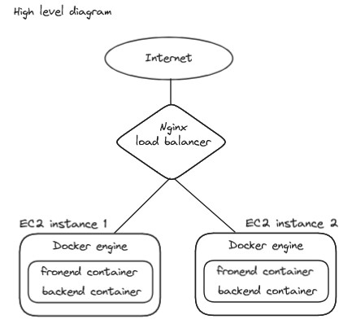

# To-do Project 
It's simple to-do project deployed in aws.

## Overview

In this diagram we can see traffic coming from internet and hitting into loadbalancer and then loadbalancer distributing traffic between two ec2 instance in a round robin manare.

## Dependencies
I did not use database to store data from frontend. I will update it further with database then no duplicate data will be present and data integrity will introduced.
